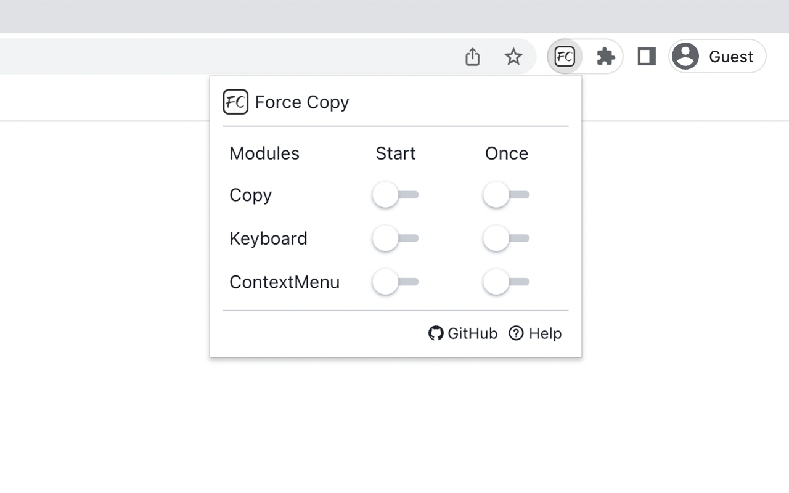

# Force Copy

Force Copy allows you to lift copy restrictions, keyboard restrictions, and right-click menu restrictions on Web pages.

## Install

* [Firefox Add-Ons](https://addons.mozilla.org/en-US/firefox/addon/force-copy/)
* [Chrome Web Store](https://chrome.google.com/webstore/detail/force-copy/cceclgeciefpanebkfkogecbjjchmico)
* [Github Releases](https://github.com/WindrunnerMax/TKScript/releases)

## Release

```bash
$ pnpm install
$ pnpm run build # Chromium
$ pnpm run build:gecko # Gecko
```

## Notice



All functions of the extension are turned off by default. When you need it, click the extension program and select the corresponding module to start it.

⭐ Start means that the domain name remains open. Even if the page is closed, it will still remain started the next time it is opened.  
⭐ Once means that it will only take effect in the current Tab page. After closing the Tab page, it will remain closed the next time it is opened. Note that refreshing the page will not turn off the function. This is useful in many situations, especially in rich text editor websites.

Open source address: https://github.com/WindrunnerMax/TKScript.


